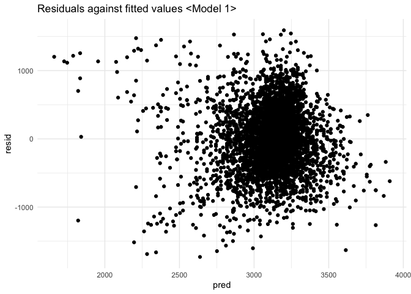
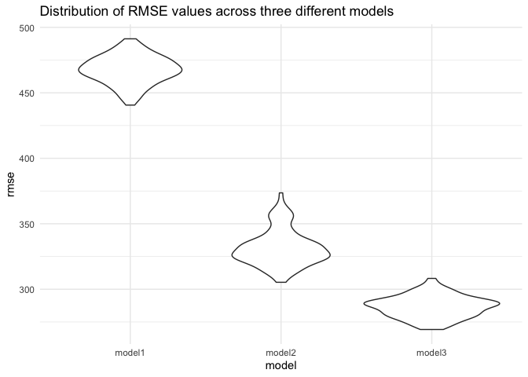
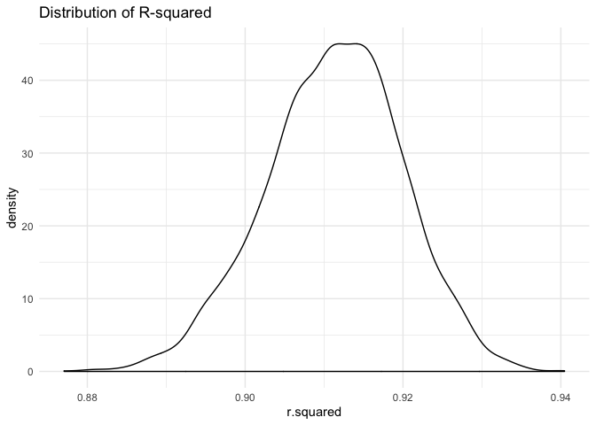
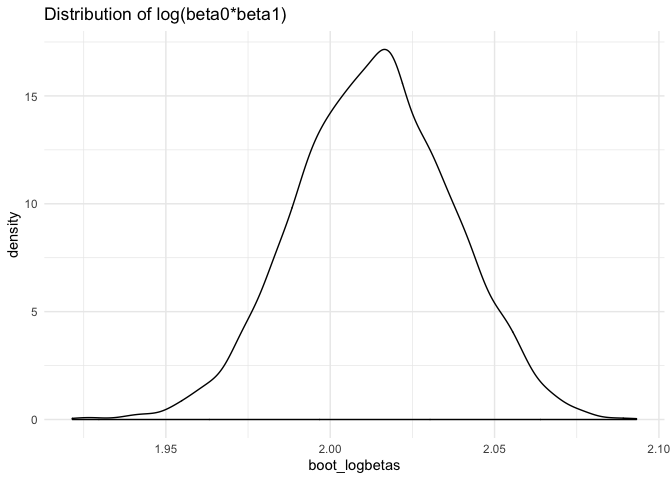

p8105\_hw6\_to2345
================

# Question 1

Load the data:

``` r
bwt = 
  read_csv(file = './birthweight.csv') %>% 
  mutate(
    babysex = as_factor(babysex),
    frace = as_factor(frace),
    malform = as_factor(malform),
    mrace = as_factor(mrace)
  )
```

    ## Parsed with column specification:
    ## cols(
    ##   .default = col_double()
    ## )

    ## See spec(...) for full column specifications.

``` r
table(is.na(bwt))
```

    ## 
    ## FALSE 
    ## 86840

  - There is no missing values in this dataset.

Proposed regression model 1: y = baby’s birth weight x = gaweeks
\<Describe your modeling process and show a plot of model residuals
against fitted values – use add\_predictions and add\_residuals in
making this plot.\>

``` r
model1 = lm(bwt ~ gaweeks, data = bwt)
summary(model1)
```

    ## 
    ## Call:
    ## lm(formula = bwt ~ gaweeks, data = bwt)
    ## 
    ## Residuals:
    ##      Min       1Q   Median       3Q      Max 
    ## -1730.52  -292.85    -0.78   303.47  1591.36 
    ## 
    ## Coefficients:
    ##             Estimate Std. Error t value Pr(>|t|)    
    ## (Intercept)  476.003     88.809    5.36 8.76e-08 ***
    ## gaweeks       66.920      2.245   29.80  < 2e-16 ***
    ## ---
    ## Signif. codes:  0 '***' 0.001 '**' 0.01 '*' 0.05 '.' 0.1 ' ' 1
    ## 
    ## Residual standard error: 466.7 on 4340 degrees of freedom
    ## Multiple R-squared:  0.1699, Adjusted R-squared:  0.1697 
    ## F-statistic: 888.3 on 1 and 4340 DF,  p-value: < 2.2e-16

``` r
# plot of model residuals against fitted values
bwt %>% 
  modelr::add_residuals(model1) %>% 
  modelr::add_predictions(model1) %>% 
  ggplot(
    aes(x = pred,
        y = resid)
  ) +
  geom_point() +
  ggtitle("Residuals against fitted values <Model 1>") +
  theme_minimal()
```

<!-- -->

Compare your model to two others: One using length at birth and
gestational age as predictors (main effects only) – Model 2 One using
head circumference, length, sex, and all interactions (including the
three-way interaction) between these – Model 3

``` r
model2 =
  lm(bwt ~ blength + gaweeks, data = bwt)

model3 =
  lm(bwt ~ bhead * blength * babysex, data = bwt)

# Cross validation between these 3 models

cv_df = crossv_mc(bwt, 100)
cv_df =
  cv_df %>% 
  mutate(
    model1 = map(train, ~lm(bwt ~ gaweeks, data = bwt)),
    model2 = map(train, ~lm(bwt ~ blength + gaweeks, data = bwt)),
    model3 = map(train, ~lm(bwt ~ bhead * blength * babysex, data = bwt))
  ) %>% 
  mutate(
    rmse_model1 = map2_dbl(model1, test, ~rmse(model = .x, data = .y)),
    rmse_model2 = map2_dbl(model2, test, ~rmse(model = .x, data = .y)),
    rmse_model3 = map2_dbl(model3, test, ~rmse(model = .x, data = .y))
  )

# Plotting the distribution of RMSE values for each candidate model
cv_df %>% 
  select(starts_with("rmse")) %>% 
  pivot_longer(
    everything(),
    names_to = "model", 
    values_to = "rmse",
    names_prefix = "rmse_") %>% 
  mutate(model = fct_inorder(model)) %>% 
  ggplot(aes(x = model, y = rmse)) + geom_violin() +
  theme_minimal()+
  ggtitle("Distribution of RMSE values across three different models")
```

<!-- -->

  - It is clear that Model 3 (using head circumference, length, sex, and
    all interactions as variables) has the least RMSE values, compared
    to the other two models.

# Problem 2

``` r
# Load the data
weather_df = 
  rnoaa::meteo_pull_monitors(
    c("USW00094728"),
    var = c("PRCP", "TMIN", "TMAX"), 
    date_min = "2017-01-01",
    date_max = "2017-12-31") %>%
  mutate(
    name = recode(id, USW00094728 = "CentralPark_NY"),
    tmin = tmin / 10,
    tmax = tmax / 10) %>%
  select(name, id, everything())
```

    ## Registered S3 method overwritten by 'crul':
    ##   method                 from
    ##   as.character.form_file httr

    ## Registered S3 method overwritten by 'hoardr':
    ##   method           from
    ##   print.cache_info httr

    ## file path:          /Users/ouyangtianna/Library/Caches/rnoaa/ghcnd/USW00094728.dly

    ## file last updated:  2019-09-26 10:27:59

    ## file min/max dates: 1869-01-01 / 2019-09-30

Question: a simple linear regression with tmax as the response and tmin
as the predictor, and are interested in the distribution of two
quantities estimated from these data: - r2 - log(β0 ∗ β1)

1). Note: broom::glance() is helpful for extracting r̂ 2 from a fitted
regression, and broom::tidy() (with some additional wrangling) should
help in computing log(β̂ 0∗β̂
1)

``` r
# Use 5000 bootstrap samples and, for each bootstrap sample, produce estimates of these two quantities.
bootstrap_weather = 
  weather_df %>% 
  modelr::bootstrap(n = 5000) %>% 
  mutate(
    models = map(strap, ~lm(tmax ~ tmin, data = .x)),
    results = map(models, broom::tidy),
    glance = map(models, broom::glance))%>% 
  select(-strap, -models) %>% 
  unnest(results, glance)

bootstrap_r2 = 
  bootstrap_weather %>% 
  select(.id, r.squared) %>% 
  unique()
view(bootstrap_r2)

bootstrap_logbetas = 
  bootstrap_weather %>% 
  group_by(.id) %>% 
  summarize(
    boot_logbetas = log(estimate[[1]]*estimate[[2]])
  )
view(bootstrap_logbetas)
```

``` r
# Plot the distribution of your estimates, and describe these in words.
bootstrap_r2 %>% 
  ggplot(aes(x = r.squared)) +
  geom_density()+
  theme_minimal() + 
  ggtitle("Distribution of R-squared")
```

<!-- -->

``` r
bootstrap_logbetas %>% 
  ggplot(aes(x = boot_logbetas)) +
  geom_density()+
  theme_minimal() + 
  ggtitle("Distribution of log(beta0*beta1)")
```

<!-- -->

  - The distribution for R-squared is approximately normal, although we
    observe slight extent of skewness.
  - The distribution for log(beta0\*beta1) is approximately
normal.

<!-- end list -->

``` r
# Using the 5000 bootstrap estimates, identify the 2.5% and 97.5% quantiles to provide a 95% confidence interval for r2 and log(beta0*beta1)
quantile(bootstrap_r2$r.squared, 0.025)
```

    ##      2.5% 
    ## 0.8936977

``` r
quantile(bootstrap_r2$r.squared, 0.975)
```

    ##     97.5% 
    ## 0.9274807

``` r
quantile(bootstrap_logbetas$boot_logbetas, 0.025)
```

    ##     2.5% 
    ## 1.966942

``` r
quantile(bootstrap_logbetas$boot_logbetas, 0.975)
```

    ##    97.5% 
    ## 2.058528

  - The 95% confidence interval for R-squared is (0.89, 0.93);
  - The 95% confidence interval for log(beta0\*beta1) is (1.86, 2.06).
